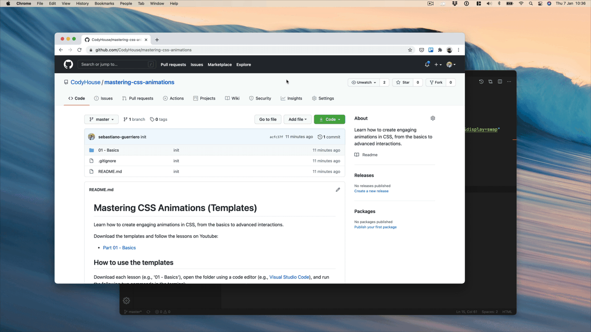

# 👨‍🎤 Mastering CSS Animations (Templates)

Learn how to create engaging animations in CSS, from the basics to advanced interactions.

Download the templates and follow the lessons on Youtube:

- [Part 01 - Basics](https://www.youtube.com/channel/UCQhxjJcgCwDW_2JqlDBsWtA)

## How to use the templates

Download each lesson (e.g., '01 - Basics'), open the folder using a code editor (e.g., [Visual Studio Code](https://code.visualstudio.com/)), and run the following two commands in the terminal:

Install the dependencies:
   
```
npm install
```

Launch your project on a development server:

```
npm run gulp watch
```



⚠️ **Notes**: 

1. If you don't have npm installed, you can get it from the [npmjs website](https://www.npmjs.com/get-npm).
2. If you receive error messages while trying to run the `npm install` command, you may need to install [Git](https://git-scm.com/) on your device first.

## Sponsored by CodyHouse UI

CodyHouse UI is a collection of accessible, progressively enhanced, HTML, CSS, JS web components.

[Explore CodyHouse UI](https://codyhouse.co/ds/components)